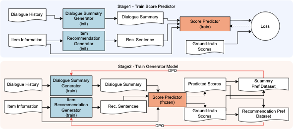

# Refining Text Generation for Realistic Conversational Recommendation via Direct Preference Optimization

[日本語](README_JP.md) | English

This repository contains the research implementation of a conversational recommender system (CRS) that refines two intermediate texts—dialogue summaries and item-recommendation information—using Direct Preference Optimization (DPO).



[View the high-resolution diagram](images/proposal_flow.pdf)

## Motivation

Conversational recommenders can make premature recommendations from short exchanges or fail to combine preferences that are implied across a longer dialogue. This project extends the SumRec pipeline by optimizing the generated dialogue summary and item-recommendation information before ranking candidate items.

The implementation covers the complete experimental workflow:

1. preprocess conversational recommendation datasets;
2. construct supervised and preference datasets;
3. train a DeBERTa or ModernBERT score predictor;
4. train text-generation models with DPO;
5. generate recommendations; and
6. evaluate ranking and text quality.

## Method

The pipeline uses two training stages.

- **Score prediction:** a DeBERTa/ModernBERT model learns to score a candidate item from the dialogue summary, recommendation information, and candidate metadata.
- **Preference optimization:** the score predictor is used to construct preference pairs. DPO then improves the dialogue-summary generator and recommendation-information generator.

The main experiments use:

- **Generator:** [Llama-3.1-Swallow-8B-v0.1](https://huggingface.co/tokyotech-llm/Llama-3.1-Swallow-8B-v0.1)
- **Score predictor:** [DeBERTa-v3-japanese-large](https://huggingface.co/globis-university/deberta-v3-japanese-large) and [llm-jp-modernbert-base](https://huggingface.co/llm-jp/llm-jp-modernbert-base)
- **Optimization:** Direct Preference Optimization with Optuna-based hyperparameter search
- **Ranking metrics:** HR@k and MRR@k
- **Text analysis:** length, Distinct-1/2, BLEU, and ROUGE

## Experimental findings

The experiments recorded in the original project showed the following trends.

- On the Tabidachi corpus, the proposed method improved HR@1/3/5 and MRR@1/3/5 over the evaluated baselines.
- On ChatRec, the proposed method achieved the strongest MRR results among the evaluated methods.
- The ablation study indicated that DPO training of the dialogue-summary generator made a particularly important contribution.

The repository includes evaluation programs and selected training metadata. Dataset files and trained model weights are excluded.

## Repository structure

```text
.
├── src/
│   ├── Tabidachi/              # Tabidachi preprocessing, training, generation, and evaluation
│   └── ChatRec/                # ChatRec preprocessing, training, generation, and evaluation
├── artifacts/
│   ├── models/
│   │   ├── deberta/            # Saved tokenizer/configuration and trainer-state metadata
│   │   └── modernbert/         # Saved tokenizer/configuration and trainer-state metadata
│   ├── dpo/recommendation/     # DPO adapter configuration and trainer-state metadata
│   └── generated_text/         # Intermediate text-generation examples
├── images/                     # Method diagram
├── eval_reason_overlap.py      # Overlap analysis for generated reasons
├── eval_reason_quality.py      # Quality analysis for generated reasons
├── metrics_sentence.py         # Text-quality metrics
└── requirements.txt            # Frozen experimental environment
```

The files under `artifacts/` are archived experimental outputs. They are kept separate from the implementation under `src/`; no trained model weights are distributed in this repository. Selected tokenizer and configuration files are retained as experiment metadata.

## Datasets

The datasets are not included. Obtain them from their original providers and follow their terms of use.

### Tabidachi corpus

- Provider: [NII Informatics Research Data Repository](https://www.nii.ac.jp/dsc/idr/rdata/Tabidachi/)
- Content: travel-agent recommendation dialogues
- Expected location: `data/Tabidachi/annotation_data/`

```text
data/Tabidachi/annotation_data/
├── annotations/
├── spot_info.json
└── タグ一覧.docx
```

### ChatRec

- Source: [Ryutaro-A/SumRec](https://github.com/Ryutaro-A/SumRec)
- Content: multi-category recommendation dialogues used for comparison
- Expected location: `data/ChatRec/chat_and_rec/`

## Environment

The experiments used Python 3.10.12, PyTorch 2.4.1, Transformers 4.46.2, TRL 0.12.1, Optuna 4.1.0, and four NVIDIA A100 80 GB GPUs. A smaller environment may run preprocessing and evaluation, but reproducing model training requires substantial GPU memory and time.

```bash
python -m venv .venv
source .venv/bin/activate
pip install -r requirements.txt
```

Weights & Biases is used by some training scripts. Authenticate in your local environment when running those scripts; credentials are not stored in this repository.

## Reproduction workflow

Run commands from the corresponding corpus directory because several scripts use paths relative to that location.

### Tabidachi

```bash
cd src/Tabidachi

python data_preprocessing.py
python create_dataset_1.py
python create_dataset_2.py
python create_dataset_3.py
python create_dataset_4.py

python train_deberta.py --method 'proposal&baseline1'
python dpo_summary_llm.py
python dpo_recommendation_llm.py
python create_recommend_data_proposal.py
python evaluate_from_recommend_data.py --method proposal
```

### ChatRec

```bash
cd src/ChatRec

python data_preprocessing.py
python create_dataset_1.py
python create_dataset_2.py
python create_dataset_3.py
python create_dataset_4.py

python train_deberta.py --method 'proposal&baseline1'
python dpo_summary_llm.py
python dpo_recommendation_llm.py
python create_recommend_data_proposal.py
python evaluate_from_recommend_data.py --method proposal
```

Additional scripts in each corpus directory cover alternative model architectures, ablation studies, prompt versions, and precomputed-ranking evaluation.

## Scope and usage

This repository publishes research code and selected metadata for technical review. It does not redistribute the Tabidachi or ChatRec datasets or trained weights. No open-source license is currently granted for this repository. Retained tokenizer/configuration files and use of pretrained models remain subject to the corresponding licenses: CC BY-SA 4.0 for DeBERTa-v3-japanese-large, Apache-2.0 for llm-jp-modernbert-base, and the Meta Llama 3.1 Community License for Llama-3.1-Swallow.
