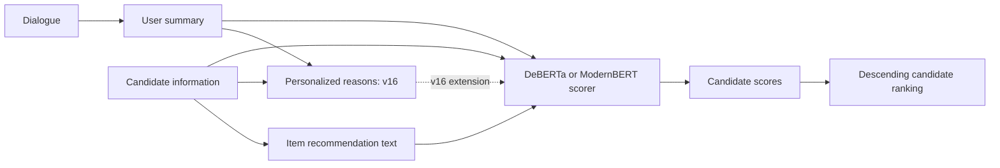

# Reason-Aware Conversational Recommendation with ModernBERT

[日本語](README_JP.md) | English

An ongoing NLP research project that adds **reasons for and against recommending an item** to SumRec, then ranks candidates with Japanese ModernBERT. The current focus is improving these reasons; outperforming SumRec / SumRec + DPO and extending the system to response generation are research goals, not completed results.


```mermaid
flowchart LR
    D[Dialogue] --> S[User summary]
    I[Candidate information] --> R[Item recommendation text]
    S --> V[Personalized reasons: v16]
    I --> V
    S --> M[DeBERTa or ModernBERT scorer]
    I --> M
    R --> M
    V -. v16 extension .-> M
    M --> P[Candidate scores]
    P --> K[Descending candidate ranking]
```

The dashed input is the v16 extension and the current research focus. The original pipeline generates recommendation text from candidate information alone; v16 reasons also use the user summary. The diagram describes the code paths, not a claim that every variant has been validated.

**Start here:** [run the CPU example](#quick-start) · [method and code map](docs/method.md) · [research reproduction](docs/reproduction.md) · [audit and remaining work](docs/repository-audit.md)

## Overview

A conversational recommender must turn a dialogue into useful preferences and compare candidate items. A fluent summary can omit a preference; a persuasive recommendation can introduce unsupported details. This project investigates the intermediate text itself: generate alternatives, score them, form preference pairs, and train generators with Direct Preference Optimization (DPO).

The current proposal explicitly connects user preferences to candidate features through recommendation and non-recommendation reasons, supplied as a fourth scorer input. The research question is whether these grounds improve **held-out candidate ranking**, not only their fluency. The repository contains both the original summary/recommendation DPO experiments (Tabidachi and ChatRec) and a Tabidachi v16 line that generates reasons for and against a candidate.

## Method and code entry points

| Variant in this repository | Scorer input / optimization | Entry point |
|---|---|---|
| `baseline2` | User summary + candidate information | [baseline2](src/Tabidachi/create_recommend_data_baseline2.py) |
| `baseline1` (SumRec-style) | Adds generated item recommendation text; no DPO generator | [baseline1](src/Tabidachi/create_recommend_data_baseline1.py) |
| `proposal` | Summary and recommendation generators trained with DPO; DeBERTa ranking | [proposal](src/Tabidachi/create_recommend_data_proposal.py) |
| `ablation1` / `ablation2` | Summary-only / recommendation-only DPO | [ablation1](src/Tabidachi/create_recommend_data_ablation1.py), [ablation2](src/Tabidachi/create_recommend_data_ablation2.py) |
| v16 four-input | Summary, candidate information, item text, personalized reasons; regression or pairwise ranking | [regression](src/Tabidachi/train_modernbert_4input_v16.py), [pairwise](src/Tabidachi/train_modernbert_pairwise_4input_v16.py) |
| v16 reason DPO | Score-guided reason preference pairs, LoRA adapter | [preference construction](src/Tabidachi/create_dataset_4_reason_v16.py), [training](src/Tabidachi/dpo_recommendation_llm_reason_v16.py) |

These are implementation labels, not verified reproductions of every baseline in the original SumRec paper. See [method details and attribution](docs/method.md) before comparing variants.

## Repository structure

```text
src/Tabidachi/       Corpus preprocessing, legacy DPO, v16 reasons, ranking
src/ChatRec/         ChatRec preprocessing, legacy DPO and evaluation
docs/               Method, execution order, audit and file inventories
examples/           Synthetic public example; no corpus excerpts
results/            Reviewed result documentation and synthetic expected metrics
requirements/       Separate environment profiles and original freeze
tests/              CPU regression tests for metrics, CLI and preprocessing
scripts/            Repository checks
data/               Placement guide; actual corpus subdirectories ignored
artifacts/          Retained experiment metadata, not runnable checkpoints
images/             Original research diagram (PNG/PDF)
```

Source paths and prompt versions are retained so ongoing jobs can continue using the existing layout. [Source inventory](docs/source-inventory.md) records imports and path literals; [artifact inventory](docs/artifact-inventory.csv) records each original artifact's disposition.

## Quick start

Python **3.10+**. This example requires no GPU, dataset, model downloads or third-party packages.

```bash
git clone https://github.com/Ichinose311/llm-text-refinement.git
cd llm-text-refinement
python -m venv .venv
# Linux/macOS: source .venv/bin/activate
# Windows PowerShell: .\.venv\Scripts\Activate.ps1
python src/Tabidachi/evaluate_precomputed_ranking.py --input-dir examples/ranking --ks 1 3 5
python -m unittest discover -s tests -v
python scripts/check_repository.py
```

The [synthetic example](examples/README.md) has two groups and six candidates. Its manually assigned scores test evaluation only; it performs no LLM inference.

| Synthetic smoke test | @1 | @3 | @5 |
|---|---:|---:|---:|
| HR | 0.50 | 1.00 | 1.00 |
| MRR | 0.50 | 0.75 | 0.75 |

The [full expected JSON](results/example-metrics.json) also includes Recall and NDCG. These numbers are **not research results**.

## Setup and datasets for research

The original README reported Python 3.10.12 and four A100 80 GB GPUs; that hardware claim has not been independently verified. GPU training is not covered by the CPU smoke test.

Use separate environments for the legacy DeBERTa/DPO pipeline and ModernBERT. The old freeze mixes incompatible packages, and its Transformers 4.46.2 pin predates ModernBERT. [Environment profiles](requirements/README.md) explain the changes and verification limits.

```bash
# In a dedicated legacy research environment:
python -m pip install -r requirements.txt
# Or, in a separate ModernBERT environment:
python -m pip install -r requirements/modernbert.txt
```

Tabidachi is available through the [NII application process](https://www.nii.ac.jp/dsc/idr/rdata/Tabidachi/). The [SumRec repository](https://github.com/Ryutaro-A/SumRec) publishes ChatRec under `data/chat_and_rec/`; check the provider's usage conditions before use. Put local corpus files in the paths described in [data/README.md](data/README.md). No raw dataset or trained weights are bundled. Some retained generated-text artifacts may contain corpus-derived material and still require a redistribution review.

## Usage

The [reproduction guide](docs/reproduction.md) gives actual preprocessing, training, inference and evaluation commands, with input/output dependencies. It separates CPU checks, GPU commands requiring local data, and legacy scripts that need experiment-specific review.

The dependency order is **preprocess → build scorer data → train scorer → construct preference pairs → DPO → generate candidate scores → evaluate**. The original README incorrectly placed preference construction before scorer training. Legacy hard-coded paths, split settings and five-run expectations mean it is not yet a one-command reproduction.

## Results and current status

No traceable held-out benchmark table is included. Training losses in `trainer_state.json` do not establish HR/MRR improvements. [Results and metric definitions](results/README.md) explain what can be checked and what must be supplied before making performance claims.

- **Implemented:** corpus preprocessing, score prediction, preference construction, DPO scripts, reason generation, regression/pairwise variants and ranking evaluation.
- **Verified in this cleanup:** synthetic CPU evaluation, 13 regression tests, Python syntax, local documentation links and retained duplicate hashes.
- **In progress:** improving recommendation/non-recommendation reasons for the four-input ModernBERT pipeline.
- **Unresolved:** original environment lock, split provenance, real-data GPU reproduction and evidence-backed benchmark reporting.
- **Planned:** compare with SumRec and SumRec + DPO, extend to response generation (not yet implemented as a verified pipeline), review corpus-derived artifacts and publish approved aggregate results with seeds and uncertainty.

An evaluation bug was corrected: the ModernBERT evaluator reported DCG as NDCG and Hit Rate as Recall. Re-evaluate saved scores before comparing with old numbers. Model training and generated scores were not changed by that fix.

## Implementation and attribution

The maintainer identifies the inherited SumRec structure as generating a dialogue summary and item recommendation text, then scoring the summary, item information and recommendation text together. Their own implemented contribution is generating recommendation and non-recommendation reasons from the summary and item features, and adding these grounds as a fourth input to ModernBERT. Reason quality is still being improved. DPO, pretrained models and the original SumRec design are credited to prior work; other scripts are not claimed as sole-author contributions. See [the contribution map](docs/method.md).

## References and scope

- [SumRec: official code and ChatRec](https://github.com/Ryutaro-A/SumRec)
- [DPO: Rafailov et al., 2023](https://arxiv.org/abs/2305.18290)
- [Japanese ModernBERT model and paper](https://huggingface.co/llm-jp/llm-jp-modernbert-base)
- [Swallow generator](https://huggingface.co/tokyotech-llm/Llama-3.1-Swallow-8B-v0.1)
- [Japanese DeBERTa](https://huggingface.co/globis-university/deberta-v3-japanese-large)
- [Tabidachi provider](https://www.nii.ac.jp/dsc/idr/rdata/Tabidachi/)

This is ongoing research code for technical review. The repository has no project-wide open-source license grant. Model, dataset and third-party artifact terms are separate; consult their providers. No new license or permission is implied by this cleanup.
