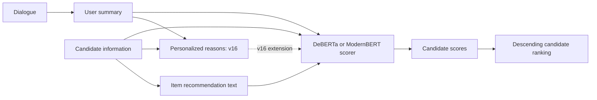

# 推薦理由・非推薦理由を加えたModernBERT対話型推薦

日本語 | [English](README.md)

SumRecの入力に、ユーザーの好みと候補の特徴を結び付ける「推薦理由・非推薦理由」を追加し、ModernBERTで候補を順位付けする、継続中のNLP研究です。現在は推薦根拠の生成を改良しており、SumRec／SumRec＋DPOを上回る推薦精度と、未着手だった応答生成への拡張を目標としています。



点線はv16で追加する入力で、現在の研究の中心です。従来系統の推薦文は候補情報から生成し、v16の個別理由はユーザー要約も参照します。図はコード上の処理を示しており、全方式の実験完了を意味しません。

**読む順番：** [手法とコードの対応](docs/method.md) → [再現手順](docs/reproduction.md) → [結果・評価定義](results/README.md)。すぐ動かす場合は下のCPU例から始められます。

## Overview — 何を改善する研究か

対話型推薦では、会話の中に分散した好みをまとめ、複数の候補を比較する必要があります。要約が重要な条件を落としたり、推薦文が根拠のない説明を加えたりすると、文章が自然でも推薦には役立たない可能性があります。

現在の提案では、対話要約とアイテム情報から「なぜそのユーザーに薦める／薦めないか」を明示的に生成し、推薦根拠として追加します。対話要約文・アイテム推薦文・アイテム情報・推薦根拠の4入力をModernBERTで評価します。比較対象としてSumRec型の実装とDPO系統も保持しています。評価対象は文章の流暢さだけでなく、未学習データでの候補ランキングです。

## Method — 比較する実装

| コード上の名前 | 入力・工夫 | コードの入口 |
|---|---|---|
| `baseline2` | 対話要約＋候補情報で予測 | [baseline2](src/Tabidachi/create_recommend_data_baseline2.py) |
| `baseline1` | SumRec型。生成した推薦文を入力に追加 | [baseline1](src/Tabidachi/create_recommend_data_baseline1.py) |
| `proposal` | 要約生成器と推薦文生成器をDPOで学習 | [proposal](src/Tabidachi/create_recommend_data_proposal.py) |
| `ablation1` / `ablation2` | 要約のみ／推薦文のみをDPOで学習 | [ablation1](src/Tabidachi/create_recommend_data_ablation1.py)、[ablation2](src/Tabidachi/create_recommend_data_ablation2.py) |
| v16・4入力 | 要約・候補情報・推薦文・個別理由を使用。回帰とペアワイズ学習を比較 | [回帰](src/Tabidachi/train_modernbert_4input_v16.py)、[ペアワイズ](src/Tabidachi/train_modernbert_pairwise_4input_v16.py) |
| v16・理由DPO | 理由の選好ペアからLoRA adapterを学習 | [選好構築](src/Tabidachi/create_dataset_4_reason_v16.py)、[学習](src/Tabidachi/dpo_recommendation_llm_reason_v16.py) |

これはリポジトリ内の実装名の整理です。SumRec論文と同一条件の再現や、提案手法の優越性を主張するものではありません。従来系統とv16の違いは[手法詳細](docs/method.md)にまとめています。

## Repository Structure

```text
src/Tabidachi/       Tabidachi前処理、従来DPO、v16理由生成・学習・評価
src/ChatRec/         ChatRec前処理、従来DPO・評価
docs/               手法、実行手順、監査、ファイル分類
examples/           公開可能な合成データの実行例
results/            結果の説明と合成例の期待値
requirements/       用途別の環境定義、元の依存関係記録
tests/              指標・CLI・前処理のCPUテスト
scripts/            構文・リンク等の確認
data/               配置ガイド。実データのディレクトリは追跡対象外
artifacts/          実験メタデータ。実行可能な重みではない
images/             元の研究図（PNG/PDF）
```

研究を継続できるよう、既存のソースとプロンプトのパスは維持しています。[全Pythonファイルの参照一覧](docs/source-inventory.md)と[成果物の分類表](docs/artifact-inventory.csv)から詳細を確認できます。

## Setup — まずCPUだけで確認

Python **3.10以上**。この例は外部ライブラリ、GPU、実データ、モデルのダウンロードが不要です。

```bash
git clone https://github.com/Ichinose311/llm-text-refinement.git
cd llm-text-refinement
python -m venv .venv
# Linux/macOS: source .venv/bin/activate
# Windows PowerShell: .\.venv\Scripts\Activate.ps1
python src/Tabidachi/evaluate_precomputed_ranking.py --input-dir examples/ranking --ks 1 3 5
python -m unittest discover -s tests -v
python scripts/check_repository.py
```

GPU研究用の依存関係は[用途別プロファイル](requirements/README.md)を参照してください。従来のDeBERTa/DPOとModernBERTには別の仮想環境を使います。

```bash
# 従来DPO系統の専用環境
python -m pip install -r requirements.txt
# ModernBERTの別環境
python -m pip install -r requirements/modernbert.txt
```

元READMEにはPython 3.10.12・A100 80GB×4の記載がありましたが、この整理作業では実機構成を確認していません。保存済みModernBERT設定はTransformers 5.13.0を示しており、旧requirementsの4.46.2とは一致しません。元のfreezeは証跡として保存し、完全再現済みの環境とは扱いません。

## Dataset

- **Tabidachi**：旅行代理店タスクの対話。[NIIの提供ページ](https://www.nii.ac.jp/dsc/idr/rdata/Tabidachi/)から利用申請が必要です。
- **ChatRec**：[SumRec公式リポジトリ](https://github.com/Ryutaro-A/SumRec)の`data/chat_and_rec/`を参照し、利用条件を確認してください。

配置先と中間データの関係は[data/README.md](data/README.md)に記載しています。生データと学習済み重みは収録していません。ただし既存の生成文にはコーパス由来の内容が含まれ得るため、公開範囲の確認が残っています。

## Usage — 前処理から評価まで

実際のコマンド、入力・出力、必要なチェックポイントは[再現手順](docs/reproduction.md)に集約しています。

処理順は **前処理 → スコア学習データ生成 → スコア予測器の学習 → 選好ペア生成 → DPO学習 → 推論 → 評価** です。選好ペア生成には先に学習したスコア予測器が必要です。従来コードには固定パスや実験ごとの設定があるため、一連のコマンドを無条件に実行すれば完全再現できる状態ではありません。

## Results / Example

公開ファイルから追跡できるHR/MRRの実験結果表は見つかっていません。学習ログの損失値だけで推薦性能の向上を主張せず、条件と結果が紐付く資料を確認してから掲載します。

動作例はすべて合成です。「静かな屋内で過ごしたい」→「静かな屋内施設を好む」という要約→「屋内展示を楽しめるが混雑は不明」という理由→博物館・公園・美術館の候補、という例でデータ構造を説明します。スコアは手動で設定しており、LLMによる生成・推論結果ではありません。

| 合成データ2グループの評価 | @1 | @3 | @5 |
|---|---:|---:|---:|
| HR | 0.50 | 1.00 | 1.00 |
| MRR | 0.50 | 0.75 | 0.75 |

HRは上位kに正解があるグループの割合、MRRは最初の正解順位の逆数の平均です。Recall・NDCGの定義とゼロ正解・同点の扱いは[評価仕様](results/README.md)、期待値は[JSON](results/example-metrics.json)に記録しています。**この表は研究成果ではありません。**

## Current Status

- **実装あり**：データ整形、スコア学習、選好ペア構築、DPO、個別理由生成、4入力・ペアワイズ評価。
- **今回確認済み**：合成CPU評価、13件の回帰テスト、構文、ローカルリンク、重複削除後の保持ファイルのハッシュ。
- **改良中**：推薦理由・非推薦理由の生成と、4入力ModernBERTによる推薦。
- **確認が必要**：データ分割の証跡、実環境の依存関係、GPU・実データでの再現、根拠付き結果表。
- **今後の目標**：SumRec／SumRec＋DPOとの比較、応答生成への拡張。応答生成を完了済みとは扱っていません。
- **公開準備**：生成文の公開可否確認、seed・ばらつきを含む結果の公開。

ModernBERT評価にあった「未正規化DCGをNDCGと表示」「HRをRecallと表示」を修正しました。過去の値と比較する場合は保存済み予測から再評価してください。学習と予測値自体はこの修正で変更していません。

## 実装・工夫と担当範囲

コードから確認できる技術要素は、コーパスごとの前処理、スコアに基づく選好ペア構築、DPO統合、個別理由のプロンプト、4入力スコア予測、ペアワイズ学習、評価ツールです。[担当範囲の確認用マップ](docs/method.md)からコードを追えます。

本人が説明した担当範囲は、**対話要約とアイテム情報から推薦理由・非推薦理由を生成し、推薦根拠をSumRecに追加してModernBERTへ4入力する実装・工夫**です。理由生成は現在も改良中です。要約・アイテム推薦文を生成して3入力でスコア予測するSumRecの構造は先行研究から引き継いでいます。DPOや事前学習モデル、その他の既存コードまで本人独自の成果とは主張しません。

## References / 公開範囲

- [SumRec公式コード・ChatRec](https://github.com/Ryutaro-A/SumRec)
- [DPO論文：Rafailov et al., 2023](https://arxiv.org/abs/2305.18290)
- [日本語ModernBERT・論文](https://huggingface.co/llm-jp/llm-jp-modernbert-base)
- [Swallow](https://huggingface.co/tokyotech-llm/Llama-3.1-Swallow-8B-v0.1)
- [日本語DeBERTa](https://huggingface.co/globis-university/deberta-v3-japanese-large)
- [Tabidachi提供元](https://www.nii.ac.jp/dsc/idr/rdata/Tabidachi/)

本リポジトリ独自のオープンソースライセンスは現時点では付与されていません。データ・事前学習モデル・第三者由来のファイルはそれぞれの提供元の条件を確認してください。整理作業によって新たな利用許諾を付与するものではありません。
